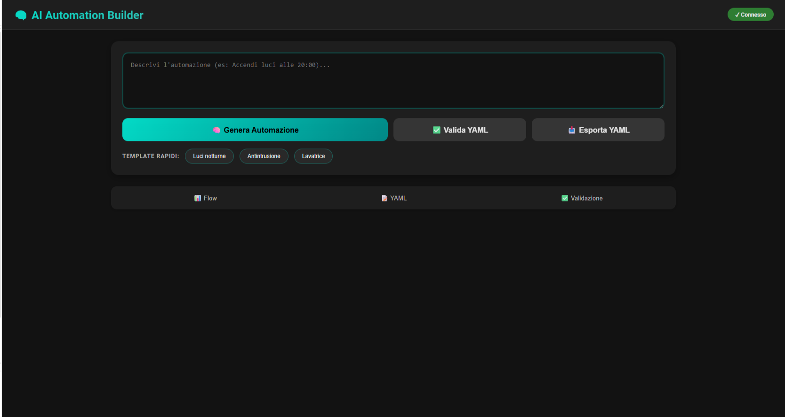

  

<h1 align="center">AI Automation Builder for Home Assistant</h1>

  Generate Home Assistant automations using artificial intelligence. 
  Describe what you want. Get production-ready YAML.

  <strong>Fast. Clean. No YAML headaches.</strong>

---

  
[][releases]  [][repo]  [][repo]

[repo]: https://github.com/P1pp89/ha-ai-automation-builder
[releases]: https://github.com/P1pp89/ha-ai-automation-builder/releases

## Interface

  

---

## Features

- Generate Home Assistant automations using AI
- Describe automations in natural language
- Output clean, valid YAML
- Supports multiple AI providers
- Easy integration via HACS

---

## Installation

### HACS (recommended)

1. Open **HACS**
2. Go to **Integrations**
3. Click **Add Custom Repository**
4. Paste: https://github.com/P1pp89/ha-ai-automation-builder
5. Search for **AI Automation Builder**
6. Click **Install**
7. Restart Home Assistant

---

### Manual

1. Download this repository
2. Copy: custom_components/ai_automation_builder into /homeassistant/custom_components/
3. Copy: www/community/ai_automation_builder into www/community/
4. Restart Home Assistant

---

## Configuration

1. Go to **Settings → Devices & Services**
2. Click **Add Integration**
3. Search for **AI Automation Builder**
4. Select your AI provider
5. Enter your API Key

### Supported Providers

- **Groq** – fast and free (recommended)
- **OpenAI**
- **GitHub Models**

---

## Usage

1. Open **AI Automation** from the sidebar
2. Describe the automation in plain language
3. Click **Generate Automation**
4. Copy the YAML
5. Paste it into Home Assistant

Done. No YAML therapy needed.

---

## Support & Contributions

- Bug reports and feature requests:  
https://github.com/P1pp89/ha-ai-automation-builder/issues

Contributions are welcome.  
Clean code and good ideas appreciated.

---

<em>Built for Home Assistant power users who prefer thinking over typing.</em>

